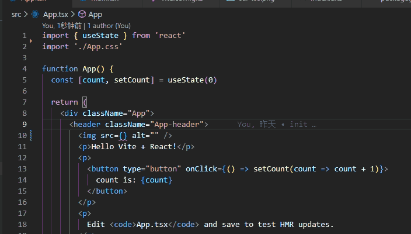

# unplugin-import-assets

[](https://www.npmjs.com/package/unplugin-import-assets)

## Why?

自动生成资源文件的typescript声明文件，让你import资源文件的时候也能有代码提示，自动导入

## Features

灵感来自[vite-plugin-hot-export](https://github.com/sudongyuer/vite-plugin-hot-export)，感谢 [@sudongyuer](https://github.com/sudongyuer)，但是

- 只生成 `d.ts` 文件，没有引用的文件不会被打包
- import时显示完整路径，可与vscode扩展 [Image preview](https://marketplace.visualstudio.com/items?itemName=kisstkondoros.vscode-gutter-preview) 配合
- 同时支持 `vite` 和 ~~`webpack` (webpack没测试过，应该可以吧😛)~~
- SVG转组件同时支持 `vue` 和 `react`

## 预览



## 使用


### 配置

```ts
export interface Options {
  /**
   * 需要处理的目录
   */
  imports: ImportOptions[]
  porjectFramework?: 'vue' | 'react'
}

export interface IPrefixOption {
  [key: string]: RegExp
}

export interface ImportOptions {
  /**
   * 目标目录
   */
  targetDir: string
  /**
   * 筛选文件
   */
  include?: FilterPattern
  /**
   * 声明文件目录，默认为 targetDir + index.d.ts
   */
  dts?: string
  /**
   * 是否将svg转换成组件，默认false
   */
  transformSvgToComponent?: boolean
  /**
   * 导出模块名前缀，设置为false关闭
   * 例子： { Img: /\.(png|jpe?g|gif|webp|ico)/i }
   */
  prefix?: IPrefixOption | boolean | string
  /**
   * 以文件目录为前缀，连接在prefixOption之后
   * 如 /src/assets/home/banner.jpg => ImgHomeBanner
   */
  dirPrefix?: boolean
}

export type FilterPattern = string | RegExp | readonly (string | RegExp)[]
```


### Vite

```ts
// vite.config.ts
import ImportAssets from 'unplugin-import-assets/vite'

export default defineConfig({
  plugins: [
    ImportAssets({
      imports: [
        { targetDir: 'src/assets', transformSvgToComponent: true, dirPrefix: true },
      ],
    }),
  ],
})
```


### Webpack

```ts
// webpack.config.js
module.exports = {
  /* ... */
  plugins: [
    require('unplugin-import-assets/webpack')({
      imports: [
        { targetDir: 'src/assets', transformSvgToComponent: true, dirPrefix: true },
      ],
    })
  ]
}
```

### Vue CLI

```ts
// vue.config.js
module.exports = {
  configureWebpack: {
    plugins: [
      require('unplugin-import-assets/webpack')({
        imports: [
          { targetDir: 'src/assets', transformSvgToComponent: true, dirPrefix: true },
        ],
      }),
    ],
  },
}
```
